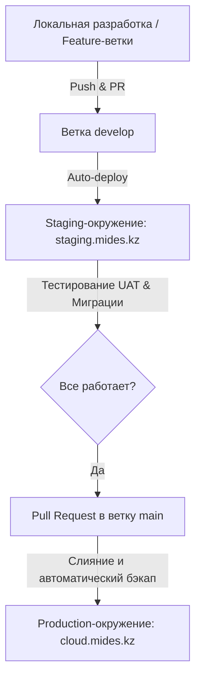

# Решение: Стратегия ветвления репозиториев и безопасного обновления ERPNext

**Статус:** PROPOSED  
**Дата:** 2026-05-27  
**Тип:** Architecture Decision Record (ADR-05)  

---

## Контекст

При переходе к кастомной разработке и частым релизам ERPNext возникает риск обрушить рабочую (Production) систему. Это обусловлено тем, что:
1. Любое изменение кода в кастомных приложениях или обновление системных зависимостей может содержать баги.
2. Обновление схемы базы данных (`bench migrate`) на живой системе без предварительного тестирования может привести к блокировкам таблиц или потере данных.
3. Сторонние приложения (HRMS, Insights, Print Designer, dfp_external_storage) обновляются их авторами независимо, и слепое использование плавающих веток (например, `develop` или `main` сторонних репозиториев) приведет к тому, что при очередном автоматическом редеплое скачается нестабильная версия.

Необходимо построить надежный процесс поставки изменений (CI/CD) и стратегию ветвления, которая исключит перерывы в работе пользователей.

---

## Решение

Принято решение внедрить **двухконтурную архитектуру деплоя** и **строгий процесс промоушена кода (Code Promotion)**.

### 1. Двухконтурная среда в Coolify
Создаются два изолированных окружения (сервиса) со своими базами данных:
1. **Production (`cloud.mides.kz`):**
   - Источник: Ветка `main` вашего репозитория.
   - Стабильная среда для работы пользователей.
2. **Staging / Testing (`staging.mides.kz`):**
   - Источник: Ветка `develop` вашего репозитория.
   - Полная копия Production-окружения (с регулярно обновляемым дампом базы данных для реалистичного тестирования).
   - Служит для проверки обновлений, новых кастомных фич и применимости миграций.



### 2. Версионирование и фиксация (Locking) сторонних приложений
В `Dockerfile` и `apps.json` запрещается использовать плавающие ветки без фиксации для Production.
- Вместо сборки с ветки `develop` или `main` сторонних приложений (например, `dfp_external_storage` или `insights`) мы фиксируем их версии через конкретные Git-теги или стабильные релизные ветки (например, `--branch version-16` для HRMS).
- Пример фиксации в `Dockerfile`:
  ```dockerfile
  RUN bench get-app hrms --branch v16.10.0 && \
      bench get-app print_designer --branch v1.3.2
  ```

### 3. Регламент безопасного обновления базы данных (Data Migration Flow)
При необходимости обновить структуру базы данных или установить новое приложение:
1. На Staging-сервер заливается свежий дамп базы данных с Production (`bench backup` -> `bench restore`).
2. В ветку `develop` пушатся изменения кода. Coolify автоматически собирает образ и запускает `bench migrate` на Staging.
3. Тестировщик / Внедренец проверяет работоспособность сценариев на Staging.
4. Перед слиянием изменений в `main` (Production):
   - Инициируется автоматический бэкап базы данных на Production (`bench backup`).
   - Код сливается в `main`, Coolify перезапускает контейнеры и выполняет `bench migrate` на Production.
   - В случае ошибок происходит моментальный откат на предыдущую версию образа и восстановление БД из свежего бэкапа.

---

## Альтернативы рассмотрены

* **Деплой напрямую из ветки `main` (одноконтурный):**
  - *Плюс:* Простота настройки, не требуется платить за второй (Staging) инстанс базы данных и контейнеров.
  - *Минус:* Высокий риск простоя системы. Любая ошибка в коде парализует работу компании.
  - *Отклонено* из-за критичности ERP-системы для бизнеса.

* **Использование Git-субмодулей для кастомных приложений:**
  - *Плюс:* Точная фиксация коммитов встроенными средствами Git.
  - *Минус:* Переусложняет Docker-сборку и работу с bench, так как bench сам умеет скачивать приложения по URL.
  - *Отклонено* в пользу указания конкретных версий/тегов при сборке в Dockerfile.

---

## Последствия

### Положительные
1. Полная безопасность: критичные изменения тестируются на реальных данных до попадания на Production.
2. Прозрачность: история изменений четко прослеживается через Pull Request'ы в Git.
3. Легкость отката: если что-то пошло не так, Coolify позволяет одной кнопкой переключить образ на предыдущий тег сборки.

### Недостатки / Требования к ресурсам
* Требуются дополнительные ресурсы сервера (ЦП и ОЗУ) для работы Staging-контура.
* Требуется время на настройку Git CI/CD и поддержку двух баз данных в актуальном состоянии.
